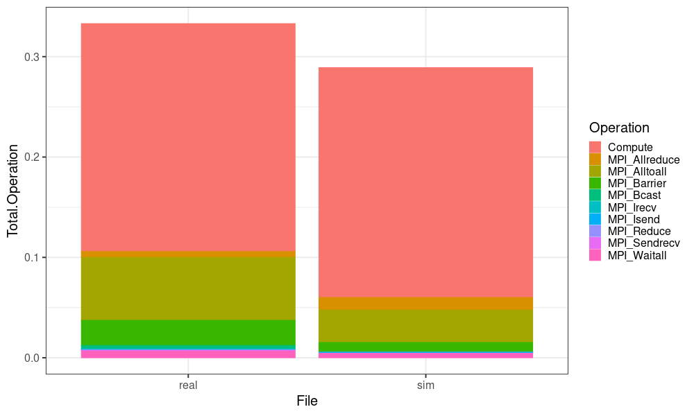
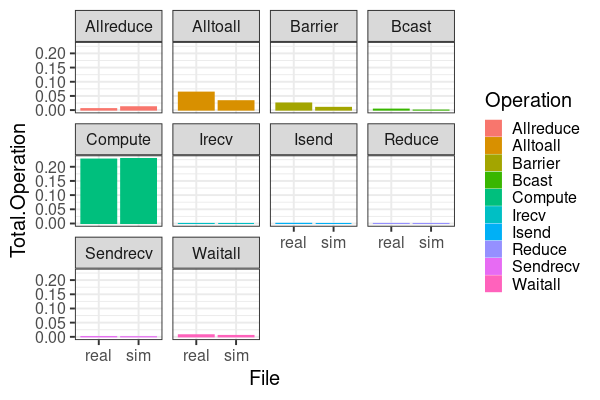
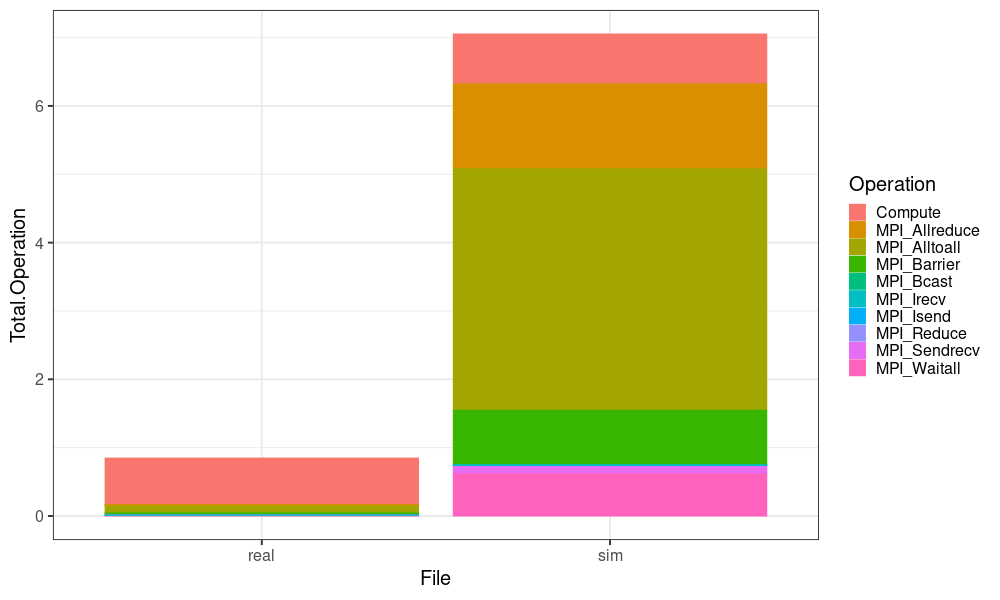
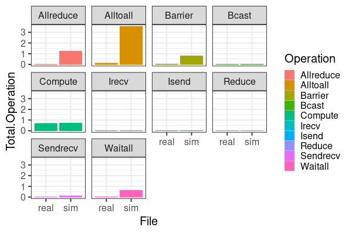

#+STARTUP: content
#+STARTUP: overview
#+STARTUP: indent

# tibble(CSV = dir_ls(BASE, regexp = "csv$", recurse=TRUE))
#+begin_src R :results output :session *R* :exports both

#+end_src

#+RESULTS:
: rastro-real-minivite64.csv rastro-sim-minivite64.csv  rastro-sim2-minivite64.csv

#+begin_src R :results output :session *R* :exports both :noweb yes :colnames yes :tangle ops-histogram.R
options(crayon.enabled=FALSE)
suppressMessages(library(tidyverse))
suppressMessages(library(fs))
library(readr)
library(dplyr)
library(stringr)

cols <- c(
  "State", "Container", "Type", "Start",
  "End", "Duration", "Depth", "Operation"
)

ops_regex <- paste(
  c(
    "Send", "Recv", "Isend", "Irecv", "Ssend", "Bsend", "Rsend",
    "Wait", "Waitall", "Waitany", "Waitsome", "Test",
    "Barrier", "Bcast", "Reduce", "Allreduce",
    "Gather", "Allgather", "Scatter", "Alltoall",
    "Scan", "Exscan"
  ),
  collapse = "|"
)

arquivos <- c("rastro-real-minivite64.csv", "rastro-sim-minivite64.csv") #(dir_ls("." , regexp = ".*64.csv$", recurse=TRUE))

dados <- map_dfr(arquivos, function(arq) {

  linhas <- read_lines(arq, progress = FALSE)
  linhas_state <- linhas[str_starts(linhas, "State")]

  read_csv(
    I(linhas_state),
    col_names = cols,
    progress = FALSE,
    show_col_types = FALSE
  ) |>
    mutate(
      File = arq,
      Rank = as.integer(gsub("rank", "", Container))
    ) |>
    mutate(Operation = gsub("^P", "", Operation)) |>
    mutate(mFile = File) |>
    separate(mFile, into=paste0("XX", 1:3), sep="-")  |>
    select(-XX1) |> select(mType = XX2, App = XX3, everything()) |>
    filter(str_detect(Operation, ops_regex)) |>
    select(File, Rank, Start, End, Duration, Operation, Type = mType, App)
})
dados |>

  ggplot(aes(x = Duration, fill=File)) +
  geom_histogram(alpha=.4, bins=100) +
  theme_bw(base_size=12) +
  facet_wrap(~Operation)

dados |>
  group_by(File, Operation, Type, App) |>
  summarize(N = n(),
            Mean = mean(Duration),
             SD = sd(Duration)) |>
  arrange(Operation) |> print(n=100) -> df
#+end_src

#+RESULTS:
#+begin_example
`summarise()` has grouped output by 'File', 'Operation', 'Type'. You can override using the `.groups`
argument.
# A tibble: 18 × 7
# Groups:   File, Operation, Type [18]
   File                       Operation     Type  App                N        Mean         SD
   <chr>                      <chr>         <chr> <chr>          <int>       <dbl>      <dbl>
 1 rastro-real-minivite64.csv MPI_Allreduce real  minivite64.csv  1408 0.000237    0.0000432
 2 rastro-sim-minivite64.csv  MPI_Allreduce sim   minivite64.csv  1408 0.000535    0.000304
 3 rastro-real-minivite64.csv MPI_Alltoall  real  minivite64.csv  2624 0.00155     0.00135
 4 rastro-sim-minivite64.csv  MPI_Alltoall  sim   minivite64.csv  2624 0.000806    0.000275
 5 rastro-real-minivite64.csv MPI_Barrier   real  minivite64.csv  1088 0.00147     0.00478
 6 rastro-sim-minivite64.csv  MPI_Barrier   sim   minivite64.csv  1088 0.000570    0.00174
 7 rastro-real-minivite64.csv MPI_Bcast     real  minivite64.csv    64 0.00346     0.0000205
 8 rastro-sim-minivite64.csv  MPI_Bcast     sim   minivite64.csv    64 0.000121    0.0000831
 9 rastro-real-minivite64.csv MPI_Irecv     real  minivite64.csv 10206 0.000000434 0.00000149
10 rastro-sim-minivite64.csv  MPI_Irecv     sim   minivite64.csv 10206 0           0
11 rastro-real-minivite64.csv MPI_Isend     real  minivite64.csv 10206 0.00000283  0.00000314
12 rastro-sim-minivite64.csv  MPI_Isend     sim   minivite64.csv 10206 0           0
13 rastro-real-minivite64.csv MPI_Reduce    real  minivite64.csv   384 0.0000206   0.0000542
14 rastro-sim-minivite64.csv  MPI_Reduce    sim   minivite64.csv   384 0.00000427  0.0000409
15 rastro-real-minivite64.csv MPI_Sendrecv  real  minivite64.csv   896 0.0000668   0.000185
16 rastro-sim-minivite64.csv  MPI_Sendrecv  sim   minivite64.csv   880 0.0000371   0.0000924
17 rastro-real-minivite64.csv MPI_Waitall   real  minivite64.csv 10368 0.0000445   0.0000727
18 rastro-sim-minivite64.csv  MPI_Waitall   sim   minivite64.csv 10368 0.0000301   0.0000819
#+end_example

#+begin_src R :results output graphics file :file (org-babel-temp-file "figure" ".png") :exports both :width 1000 :height 600 :session *R*
dados |> filter(str_detect(Operation, ops_regex)) |>
  ggplot(aes(x = Type, y = Duration, color = Type)) +
  geom_boxplot() +
  facet_wrap(. ~ Operation) + #, scales="free") +
  theme_bw(base_size = 25)
#+end_src

#+RESULTS:
[[file:/tmp/babel-nMDsva/figureMaiEL1.png]]

#+begin_src R :results output graphics file  :file  (org-babel-temp-file "figure" ".png") :exports both :width 1000 :height 600 :session *R*
df |>
  ggplot(aes(x = Type, y = Mean, fill = Operation)) + do
  geom_col() +
  ## geom_jitter(data=dados, aes(x=Type, y=Duration), alpha=0.01) +
  geom_errorbar(aes(ymin = Mean - SD, ymax = Mean + SD)) +
  facet_wrap(. ~ Operation) + #, scales="free") +
  theme_bw(base_size = 20)
#+end_src

#+RESULTS:
[[file:/tmp/babel-nMDsva/figure9lZM8V.png]]

#+begin_src R :results output :session *R* :exports both
dados |>
  mutate(File = str_extract(File, "real|sim")) |>
  group_by(File, Rank) |>
  arrange(Start) |>
  mutate(Start.Next = lead(Start)) |>
  filter(!is.na(Start.Next)) |>
  mutate(Operation = "Compute") |>
  mutate(Duration = Start.Next - End) |>
  select(File, Rank, Start = End, End = Start.Next, Duration, Operation) -> dados.compute

bind_rows(dados |>
        mutate(File = str_extract(File, "real|sim")), dados.compute) -> dados.all

dados.all |>
  group_by(File) |>
  mutate(Makespan = max(End)) |>
  group_by(File, Operation, Makespan) |>
  summarize(Total.Operation = sum(Duration) / length(unique(Rank)),
          Mean.Operation = mean(Duration), .groups="keep") |>
  mutate(P = round(Total.Operation / Makespan * 100, 2)) |>
  arrange(-P) -> dados.gasto
#+end_src

#+RESULTS:

* Compare execution with operation times
#+begin_src R :results output graphics file :file imgs/execution-time-div-by-opps.png :exports both :width 1000 :height 600 :session *R*
dados.gasto |>
  ggplot(aes(x = File, y = Total.Operation, color = Operation, fill = Operation)) +
  geom_col() + theme_bw(base_size = 20)
#+end_src

#+RESULTS:

The compute time seems pretty similar when comparing its total result
in the application final time. The All_to_All and Bcast seems to have
more impact in the final time result. Let's look to the per operation data.

* Compare operation times individually
#+begin_src R :results output graphics file :file imgs/compare-opps-time.png :exports both :width 600 :height 400 :session *R*
dados.gasto |> mutate(Operation = gsub("MPI_", "", Operation)) |>
  ggplot(aes(x = File, y = Total.Operation, color = Operation, fill = Operation)) +
  geom_col() +
  facet_wrap(~ Operation) +
  theme_bw(base_size = 20)
#+end_src

#+RESULTS:

Here we can confirm that the compute time is basically the same in the
real and sim versions, but that the all to all and barrier shows a
higher time. The sum of the differences of broadcast and all_to_all
are:

#+begin_src R :results output :session *R* :exports both
dados.gasto |> group_by(Operation) |>
  summarise(
    real = Total.Operation[File == "real"],
    sim = Total.Operation[File == "sim"],
    diff = real - sim
) -> data.ops.diffs

sum(data.ops.diffs$diff[df$Operation %in% c("MPI_Bcast", "MPI_Alltoall")])

#+end_src

#+RESULTS:
: [1] 0.04621845

The sum of the difference of Bcast and All to All is 0.046. Very
similar with the difference between the simulation and the real execution:

#+begin_src R :results output :session *R* :exports both
dados |> group_by(File) |> mutate(File = str_extract(File, "real|sim")) |>
  summarise(Fim = max(End)) |>
  pivot_wider(names_from=File, values_from=Fim) -> data.diff

time_diff <- data.diff |> mutate(diff = real - sim) |> pull(diff)

time_diff
#+end_src

#+RESULTS:
: [1] 0.047781

A total of 0.047 seconds of difference between the simulation and the
real world execution. This value is a little higher then the value
obtained previously by only counting the differences for the Bcast and
Alltoall.

This value represents:

#+begin_src R :results output :session *R* :exports both
sim_time <- data.diff |> pull(sim)
real_time <- data.diff |> pull(real)

cat("SIM time:", sim_time, "\n")
cat("REAL time:", real_time, "\n")

cat("Diff in percent in SIM:", (time_diff / sim_time) * 100, "\n")
cat("Diff in percent in REAL:", (time_diff / real_time) * 100, "\n")
#+end_src

#+RESULTS:
: SIM time: 0.289142
: REAL time: 0.336923
: Diff in percent in SIM: 16.5251
: Diff in percent in REAL: 14.18158

This means that currently the simulation has a error of more than 10%
in execution time, even though the computation time is almost the
same.

* Diff per operation
#+begin_src R :results output :session *R* :exports both
dados.gasto |> group_by(Operation) |>
  summarise(
    real = Total.Operation[File == "real"],
    sim = Total.Operation[File == "sim"],
    diff = real - sim
)

#+end_src

#+RESULTS:
#+begin_example
# A tibble: 10 × 4
   Operation          real       sim       diff
   <chr>             <dbl>     <dbl>      <dbl>
 1 Compute       0.227     0.229     -0.00199
 2 MPI_Allreduce 0.00521   0.0118    -0.00656
 3 MPI_Alltoall  0.0634    0.0331     0.0303
 4 MPI_Barrier   0.0250    0.00969    0.0154
 5 MPI_Bcast     0.00346   0.000121   0.00334
 6 MPI_Irecv     0.0000693 0          0.0000693
 7 MPI_Isend     0.000451  0          0.000451
 8 MPI_Reduce    0.000124  0.0000256  0.0000983
 9 MPI_Sendrecv  0.000935  0.000511   0.000425
10 MPI_Waitall   0.00721   0.00488    0.00233
#+end_example

Even though computation has the highest percent in the execution, the
difference in time is just of 1.9e-3. This means that the computation
time is similar in the execution and simulation.

* Seeing again for a longer run:
#+begin_src R :results output :session *R* :exports both :noweb yes :colnames yes :tangle ops-histogram.R
options(crayon.enabled=FALSE)
suppressMessages(library(tidyverse))
suppressMessages(library(fs))
library(readr)
library(dplyr)
library(stringr)

cols <- c(
  "State", "Container", "Type", "Start",
  "End", "Duration", "Depth", "Operation"
)

ops_regex <- paste(
  c(
    "Send", "Recv", "Isend", "Irecv", "Ssend", "Bsend", "Rsend",
    "Wait", "Waitall", "Waitany", "Waitsome", "Test",
    "Barrier", "Bcast", "Reduce", "Allreduce",
    "Gather", "Allgather", "Scatter", "Alltoall",
    "Scan", "Exscan"
  ),
  collapse = "|"
)

arquivos <- c("longer-real-minivite.csv", "longer-sim-minivite.csv") #(dir_ls("." , regexp = ".*64.csv$", recurse=TRUE))

dados <- map_dfr(arquivos, function(arq) {

  linhas <- read_lines(arq, progress = FALSE)
  linhas_state <- linhas[str_starts(linhas, "State")]

  read_csv(
    I(linhas_state),
    col_names = cols,
    progress = FALSE,
    show_col_types = FALSE
  ) |>
    mutate(
      File = arq,
      Rank = as.integer(gsub("rank", "", Container))
    ) |>
    mutate(Operation = gsub("^P", "", Operation)) |>
    mutate(mFile = File) |>
    separate(mFile, into=paste0("XX", 1:3), sep="-")  |>
    select(-XX1) |> select(mType = XX2, App = XX3, everything()) |>
    filter(str_detect(Operation, ops_regex)) |>
    select(File, Rank, Start, End, Duration, Operation, Type = mType, App)
})
dados |>

  ggplot(aes(x = Duration, fill=File)) +
  geom_histogram(alpha=.4, bins=100) +
  theme_bw(base_size=12) +
  facet_wrap(~Operation)

dados |>
  group_by(File, Operation, Type, App) |>
  summarize(N = n(),
            Mean = mean(Duration),
             SD = sd(Duration)) |>
  arrange(Operation) |> print(n=100) -> df
#+end_src

#+RESULTS:
#+begin_example
`summarise()` has grouped output by 'File', 'Operation', 'Type'. You can override using the `.groups`
argument.
# A tibble: 18 × 7
# Groups:   File, Operation, Type [18]
   File                     Operation     Type  App              N        Mean          SD
   <chr>                    <chr>         <chr> <chr>        <int>       <dbl>       <dbl>
 1 longer-real-minivite.csv MPI_Allreduce real  minivite.csv  1600 0.000250    0.000174
 2 longer-sim-minivite.csv  MPI_Allreduce sim   minivite.csv  1600 0.0497      0.0163
 3 longer-real-minivite.csv MPI_Alltoall  real  minivite.csv  3008 0.00245     0.00208
 4 longer-sim-minivite.csv  MPI_Alltoall  sim   minivite.csv  3008 0.0755      0.0168
 5 longer-real-minivite.csv MPI_Barrier   real  minivite.csv  1088 0.00178     0.00767
 6 longer-sim-minivite.csv  MPI_Barrier   sim   minivite.csv  1088 0.0466      0.0588
 7 longer-real-minivite.csv MPI_Bcast     real  minivite.csv    64 0.00321     0.0000269
 8 longer-sim-minivite.csv  MPI_Bcast     sim   minivite.csv    64 0.0123      0.00871
 9 longer-real-minivite.csv MPI_Irecv     real  minivite.csv 11718 0.000000474 0.00000174
10 longer-sim-minivite.csv  MPI_Irecv     sim   minivite.csv 11718 0           0
11 longer-real-minivite.csv MPI_Isend     real  minivite.csv 11718 0.00000296  0.00000335
12 longer-sim-minivite.csv  MPI_Isend     sim   minivite.csv 11718 0.00000951  0.000000573
13 longer-real-minivite.csv MPI_Reduce    real  minivite.csv   384 0.0000287   0.0000954
14 longer-sim-minivite.csv  MPI_Reduce    sim   minivite.csv   384 0.000369    0.00305
15 longer-real-minivite.csv MPI_Sendrecv  real  minivite.csv   896 0.0000894   0.000238
16 longer-sim-minivite.csv  MPI_Sendrecv  sim   minivite.csv   880 0.00767     0.0186
17 longer-real-minivite.csv MPI_Waitall   real  minivite.csv 11904 0.0000453   0.0000765
18 longer-sim-minivite.csv  MPI_Waitall   sim   minivite.csv 11904 0.00340     0.00876
#+end_example

#+begin_src R :results output :session *R* :exports both
dados |>
  mutate(File = str_extract(File, "real|sim")) |>
  group_by(File, Rank) |>
  arrange(Start) |>
  mutate(Start.Next = lead(Start)) |>
  filter(!is.na(Start.Next)) |>
  mutate(Operation = "Compute") |>
  mutate(Duration = Start.Next - End) |>
  select(File, Rank, Start = End, End = Start.Next, Duration, Operation) -> dados.compute

bind_rows(dados |>
        mutate(File = str_extract(File, "real|sim")), dados.compute) -> dados.all

dados.all |>
  group_by(File) |>
  mutate(Makespan = max(End)) |>
  group_by(File, Operation, Makespan) |>
  summarize(Total.Operation = sum(Duration) / length(unique(Rank)),
          Mean.Operation = mean(Duration), .groups="keep") |>
  mutate(P = round(Total.Operation / Makespan * 100, 2)) |>
  arrange(-P) -> dados.gasto
#+end_src

#+RESULTS:

** Compare execution with operation times
#+begin_src R :results output graphics file :file imgs/longer-execution-time-div-by-opps.png :exports both :width 1000 :height 600 :session *R*
dados.gasto |>
  ggplot(aes(x = File, y = Total.Operation, color = Operation, fill = Operation)) +
  geom_col() + theme_bw(base_size = 20)
#+end_src

#+RESULTS:

Ok, now the results are inverted, we see that the time was way longer
in the simulation. (But the compute time is basically the same).

Maybe this strange result can be because of the MPI calibration that
was active. I will run again without it.

** Compare operation times individually
#+begin_src R :results output graphics file :file imgs/longer-compare-opps-time.png :exports both :width 600 :height 400 :session *R*
dados.gasto |> mutate(Operation = gsub("MPI_", "", Operation)) |>
  ggplot(aes(x = File, y = Total.Operation, color = Operation, fill = Operation)) +
  geom_col() +
  facet_wrap(~ Operation) +
  theme_bw(base_size = 20)
#+end_src

#+RESULTS:

The compute time is almost the same again.

#+begin_src R :results output :session *R* :exports both
dados.gasto |> group_by(Operation) |>
  summarise(
    real = Total.Operation[File == "real"],
    sim = Total.Operation[File == "sim"],
    diff = real - sim
) -> data.ops.diffs

sum(data.ops.diffs$diff[df$Operation %in% c("MPI_Allreduce", "MPI_Barrier", "MPI_Alltoall")])

#+end_src

#+RESULTS:
: [1] -5.473813

#+begin_src R :results output :session *R* :exports both
dados |> group_by(File) |> mutate(File = str_extract(File, "real|sim")) |>
  summarise(Fim = max(End)) |>
  pivot_wider(names_from=File, values_from=Fim) -> data.diff

time_diff <- data.diff |> mutate(diff = real - sim) |> pull(diff)

time_diff
#+end_src

#+RESULTS:
: [1] -6.204352

[09:16:16; 01.04.2026]: Again, most part of the difference came from
MPI collective operations.
